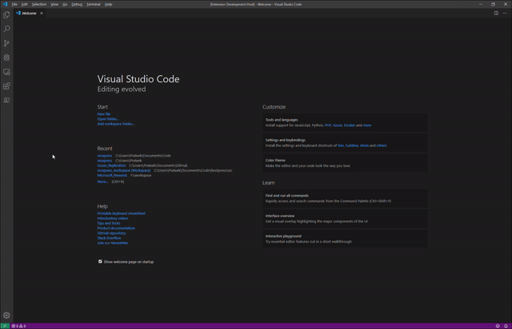

# ResXpress
ResXpress extension handles opening of `.resx` files in Visual Studio code.

## Features

- Command **ResXpress: Preview Resx**  
  It will preview resx as a markdown table.
  
  

## Requirements

- Built in markdown support
- VS code 1.40+

## Extension Settings

None as of now

## Known Issues

None as of now 

## Release Notes

### 1.0.0

Initial release of ResXpress

