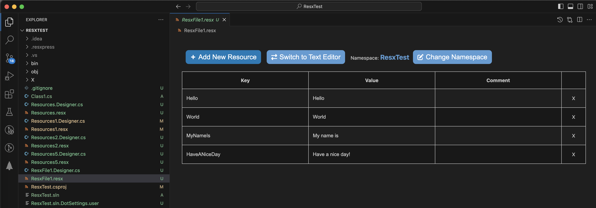
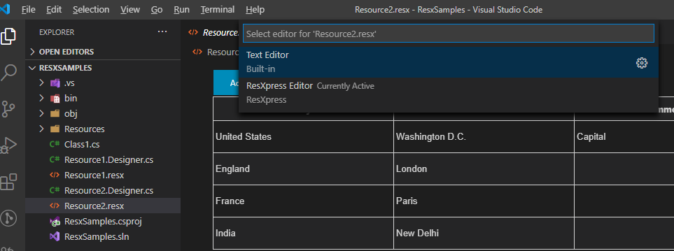
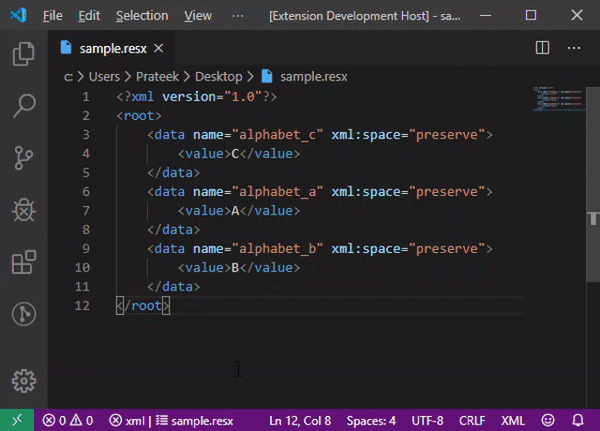
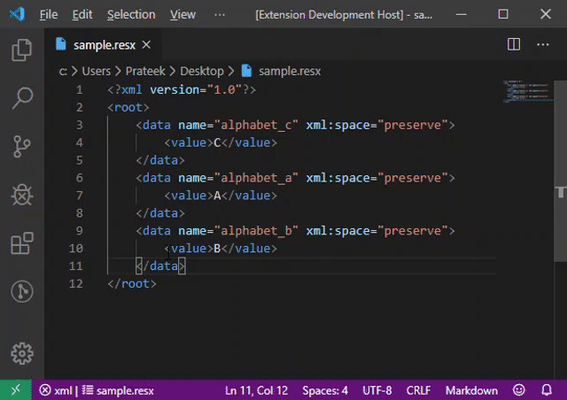
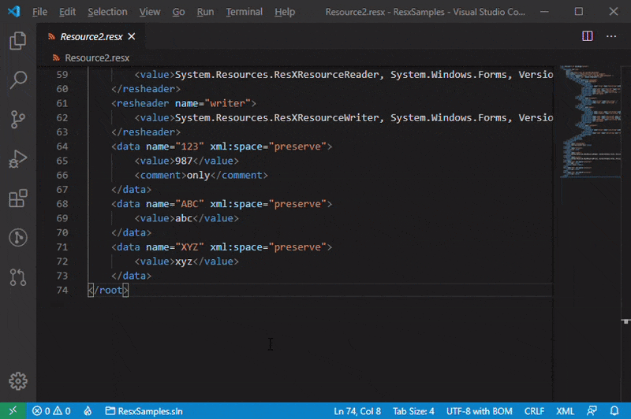
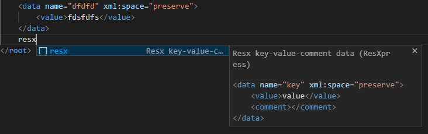

# ResXpress

Resx editor, previewer and reorganizer extension for Visual Studio Code and VSCodium.

<!-- Visual Studio MarketPlace: Version|Installs|Downloads|Rating -->
  

---

## Features

### Custom Resx Editor

This is **active by default** when the file is opened, _however_ you can choose to open from **Explorer Panel - Right Click on the resx file - Choose ResXpress Editor**

Below is the **Text Editor** vs. **Resx Editor** side by side comparision.

It offers the following features;

- Adding a new resx data.
- Editing an existing resx data.
- Deleting an existing resx data.
- Checks for resx data with duplicate keys and shows error if exists.
- To and Fro updates between Text document and ResxEditors as soon as typed valid resx data.
- To and fro updates Text document and ResxEditors when Save triggered on either.
- Automatically regenerate strongly typed resource class file(controlled by setting)
- Add a new resx file.
- Update C# namespace of a resx file.

### ResXpress: Markdown Preview

Preview resx file as Markdown table.

### ResXpress: Sort By Keys

Reorganize file by sorting by Keys.

### ResXpress: Web Preview

Preview resx file as a nice Webview table.

### Adding new resx file

### Updating resx C# namespace

### Resx Data Snippet

- Type `resx` and snippet will pop up.
- If it doesnt then Control+Space(CMD+Space for Mac) to trigger intellisense.
- Edit key, value and comment values(press Tab to go to next editable value)

### Settings

1. `generateStronglyTypedResourceClassOnSave`: Generate/update strongly typed resource class files when updates to resx files are made.  
Default: **`false`**.  
Ex: Resource1.resx → Resource1.Designer.cs  

1. `useFileScopedNamespace`: Use File Scoped Namespace.  
Default: **`true`**  
**true**: File scoped namespaces.  
**false**: Block scoped namespaces.  

1. `indentSpaceLength`: Indent space length for resx xml.
Default: **4**.
Options: **2, 4, 8**.

## Known Issues

None as of now.

## Release Notes

[ChangeLog](./CHANGELOG.md)
