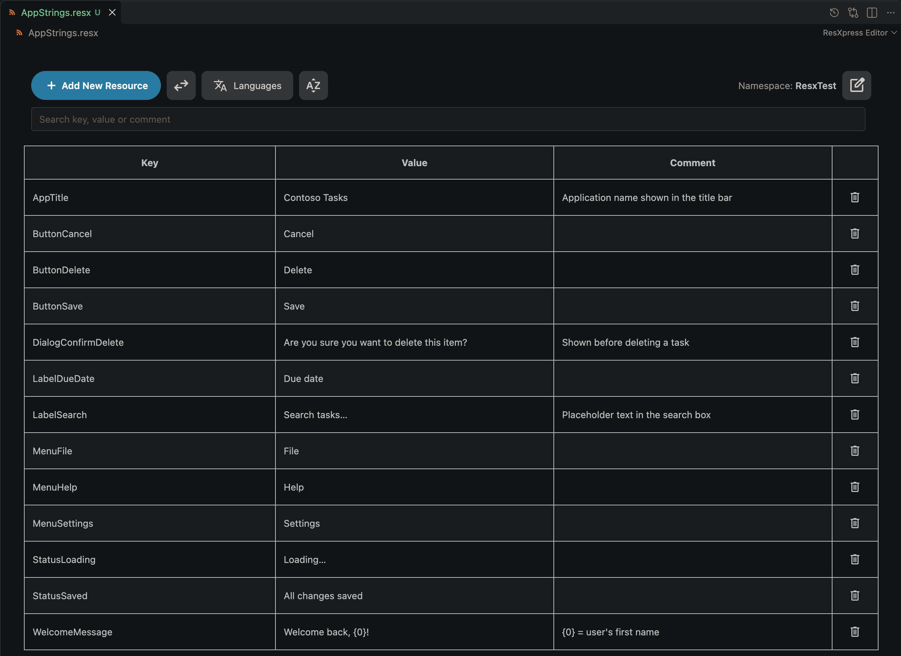
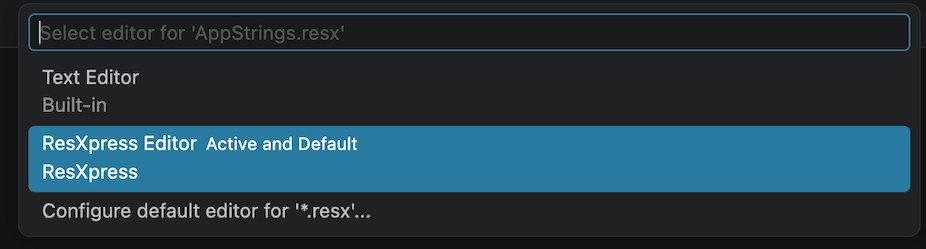
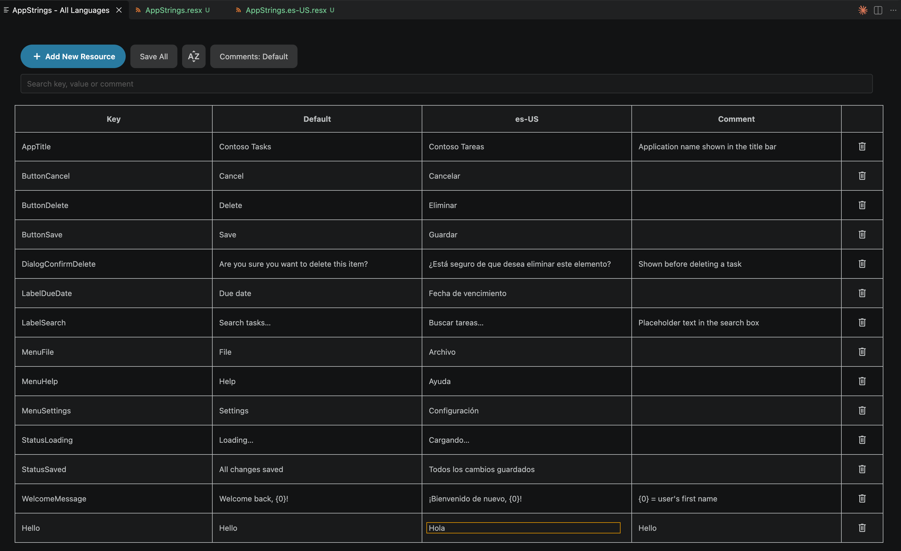
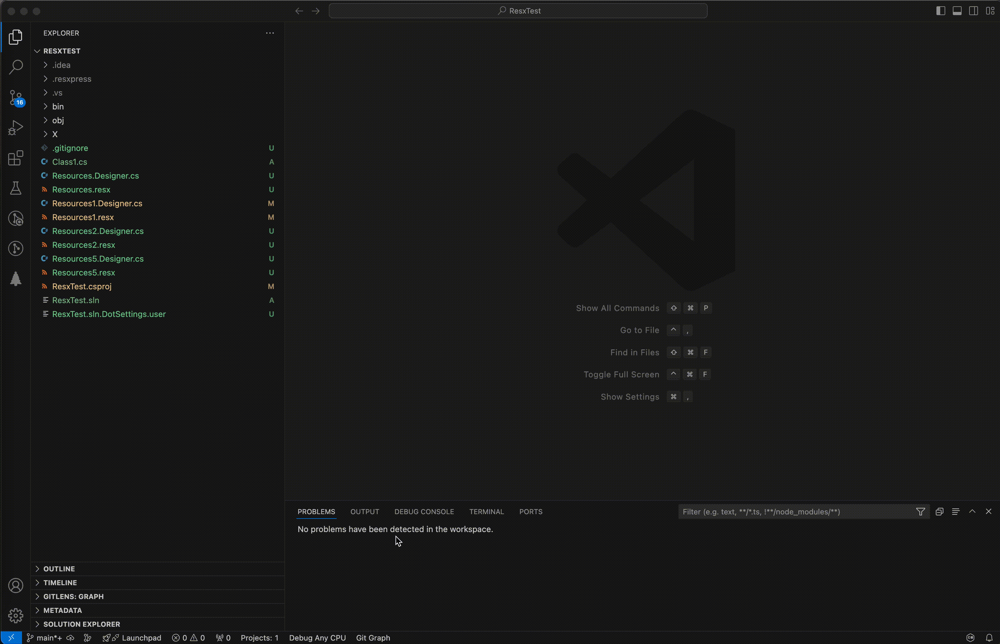

# ResXpress

Resx editor, previewer and reorganizer extension for Visual Studio Code and VSCodium.


[](https://choosealicense.com/licenses/mit/)

<!-- Visual Studio MarketPlace: Version|Installs|Downloads|Rating -->
[](https://marketplace.visualstudio.com/items?itemName=PrateekMahendrakar.resxpress)

<!-- Open VSX: Version|Downloads|Rating -->
[](https://open-vsx.org/extension/PrateekMahendrakar/resxpress)

---

## Contents

- [Features](#features)
  - [Custom Resx Editor](#custom-resx-editor)
  - [Search within a resx file](#search-within-a-resx-file)
  - [ResXpress: Edit All Languages](#resxpress-edit-all-languages)
  - [ResXpress: Markdown Preview](#resxpress-markdown-preview)
  - [ResXpress: Sort By Keys](#resxpress-sort-by-keys)
  - [ResXpress: Web Preview](#resxpress-web-preview)
  - [Adding new resx file](#adding-new-resx-file)
  - [Updating resx C# namespace](#updating-resx-c-namespace)
  - [Resx Data Snippet](#resx-data-snippet)
  - [Settings](#settings)
  - [Indentation](#indentation)
- [Known Issues](#known-issues)
  - [A resx diff shows two ResXpress editors instead of a text diff](#a-resx-diff-shows-two-resxpress-editors-instead-of-a-text-diff)
  - [Search results open the ResXpress editor at the top, not at the match](#search-results-open-the-resxpress-editor-at-the-top-not-at-the-match)
- [Release Notes](#release-notes)

## Features

### Custom Resx Editor



This is **active by default** when the file is opened. To switch between it and the text editor, right-click the resx file in the Explorer and choose **Open With...**, or run **View: Reopen Editor With...** on an open tab.



It offers the following features;

- Adding a new resx data.
- Editing an existing resx data.
- Deleting an existing resx data.
- Multi-line values and comments are shown and edited in full; each row grows to fit.
- [Searching](#search-within-a-resx-file) by key, value or comment to filter down a large resx file.
- Checks for resx data with duplicate keys and shows error if exists.
- To and Fro updates between Text document and ResxEditors as soon as typed valid resx data.
- To and fro updates Text document and ResxEditors when Save triggered on either.
- Preserves the file as it was written: indentation, line endings, comment positions and the trailing
newline all survive an edit, and only the lines you changed are rewritten. The one exception is
`&apos;` and `&quot;` in values, which are written as `'` and `"` - both are valid XML and
mean the same thing, and it is how .NET writes them too.
- Automatically regenerate strongly typed resource class file(controlled by setting)
- Add a new resx file.
- Update C# namespace of a resx file.

### Search within a resx file

The search box under the toolbar filters the table as you type, matching the key, value or
comment of each row, case-insensitively. Rows that don't match are hidden, and a counter such
as `Showing 3 of 240` shows how many are left.

- `Ctrl+F` (`Cmd+F` on macOS) focuses the search box, and `Esc` clears it.
- Editing, adding and deleting rows all work while a filter is on.
- The filter and the scroll position are kept when you switch to another tab and back.
- **Edit All Languages** has the same search box, and it matches every language column.

To search across every resx file in the workspace, use VS Code's own Search view - but see
[the known issue](#search-results-open-the-resxpress-editor-at-the-top-not-at-the-match)
about where a result opens.

### ResXpress: Edit All Languages

Every culture of a resource in one editable table, one column per language - `Resource1.resx`,
`Resource1.de.resx`, `Resource1.fr.resx` and so on side by side, instead of one file at a time.

Open it with the **Languages** button in the resx editor's toolbar, from the command
palette, or by right-clicking a resx editor tab or a resx file in the Explorer. Any culture of
the resource will do: the whole family is found from whichever file you start on.

The button, the command palette entry and the editor menu entries appear **only when the
resource actually has other languages** - a lone `Resource1.resx` with no
`Resource1.<culture>.resx` beside it has nothing to combine. The Explorer entry shows on every
resx file, and tells you when there is nothing to combine.

- Each column writes back to its own file, using the same minimal-edit path as the single file
  editor, so a translation file only ever gains the lines you actually changed.
- A key missing from a translation shows as a highlighted empty cell - typing in it adds the
  entry to that language alone, and clearing a cell removes it again. Nothing writes blank
  entries into languages you did not touch.
- **Comments** collapse to a single column showing the default language's comment, or expand to
  one column per language for translated comments. The toolbar button switches between the two;
  the columns you hide are never rewritten.
- The Key column stays pinned while the languages scroll sideways, so the table stays readable
  however many languages there are.
- **Save All** saves every file the table has changed - most of them are not open in a tab of
  their own. Deleting a row removes that key from every language.
- Files you edit here show as unsaved until you save them, exactly as they would if you had
  edited them by hand - including in any tab that already had one of them open.



### ResXpress: Markdown Preview

Preview resx file as Markdown table.

### ResXpress: Sort By Keys

Reorganize file by sorting by Keys.

### ResXpress: Web Preview

Preview resx file as a nice Webview table.

### Adding new resx file



### Updating resx C# namespace

The resx editor shows the resource's namespace beside the toolbar, and the edit button next to
it changes it. The namespace is saved in `.resxpress/namespace-mapping.json` at the workspace
root and is used when generating the strongly typed `Designer.cs` class.

When there is no mapping, the namespace is read from the resource's existing `Designer.cs`. A
culture file such as `Resource1.es.resx` uses the namespace of its default file,
`Resource1.resx`, unless it has a mapping of its own.

### Resx Data Snippet

- Type `resx` and snippet will pop up.
- If it doesnt then Control+Space(CMD+Space for Mac) to trigger intellisense.
- Edit key, value and comment values(press Tab to go to next editable value)


### Settings

1. `generateStronglyTypedResourceClassOnSave`: Generate/update strongly typed resource class files when updates to resx files are made.  
Default: **`false`**.  
Ex: Resource1.resx → Resource1.Designer.cs  

1. `useFileScopedNamespace`: Use File Scoped Namespace.  
Default: **`true`**  
**true**: File scoped namespaces.  
**false**: Block scoped namespaces.  

1. `indentSpaceLength`: **Deprecated, and will be removed in a future version** — use
`editor.insertSpaces` and `editor.tabSize` instead.
It is still honoured wherever it is explicitly set.
Options: **2, 4, 8**.

1. `enableLocalLogs`: Enable local logs, shown in the Output window.  
Default: **`false`**.

### Indentation

A resx that is already indented keeps its own style, tabs included: ResXpress copies whatever
the file uses, so a one-character edit stays a one-character edit in the diff. Indentation is
only _chosen_ where there is nothing to copy — a new file made with **Create Resx File**, or a
file with no indentation at all — and that choice follows your editor: a tab when
`editor.insertSpaces` is off, otherwise `editor.tabSize` spaces.

## Known Issues

### A resx diff shows two ResXpress editors instead of a text diff

ResXpress is the default editor for `.resx`, and VS Code gives a custom editor no way to opt
out of diff mode - so opening a resx from Source Control paints the ResXpress editor on both
sides instead of a text diff
([vscode-discussions#799](https://github.com/microsoft/vscode-discussions/discussions/799)).
There is nothing the extension can do about this; VS Code's fix for it is still a proposed
API ([vscode#298924](https://github.com/microsoft/vscode/issues/298924)).

If you diff resx files often, this user setting sends them to the plain text editor:

```json
"workbench.editorAssociations": {
    "{git,gitlens,vscode-local-history}:/**/*.resx": "default"
}
```

ResXpress does not add this for you, because it is a trade rather than a fix. It is a global
setting that follows you to every workspace, and it covers more than diffs - a resx opened
from Source Control history or from the Timeline becomes plain text too, so you lose the
ResXpress table for reading those. Editors that are already open keep the editor they opened
with, so close and reopen a diff after adding it.

### Search results open the ResXpress editor at the top, not at the match

VS Code's Search view (`Ctrl+Shift+F`, `Cmd+Shift+F` on macOS) finds text inside resx files,
but clicking a result opens the ResXpress editor without scrolling to or highlighting the
match. VS Code passes a result's position only to text editors. A custom editor like ResXpress
is never told what was searched for or where the match is, and no extension API exists to get
it.

To find the entry, type the same text into the editor's own
[search box](#search-within-a-resx-file). To land on the exact line, switch that file to the text
editor, using the swap button in the ResXpress toolbar or the editor picker at the top right of
the tab, and click the result again.

## Release Notes

See the [ChangeLog](./CHANGELOG.md) for what changed in each version.
